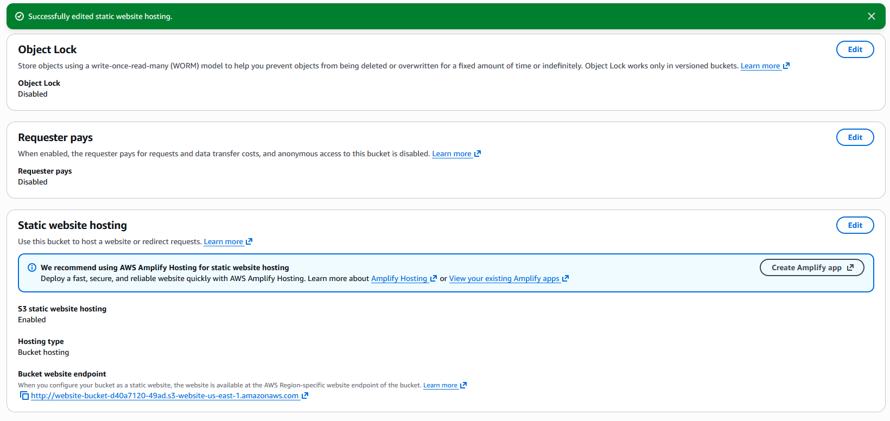
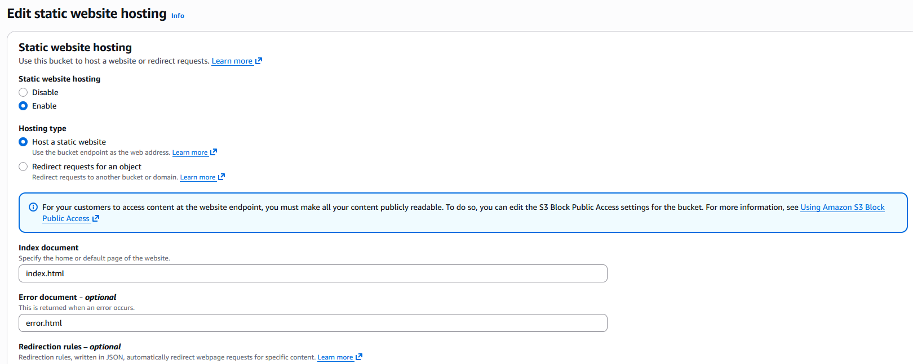
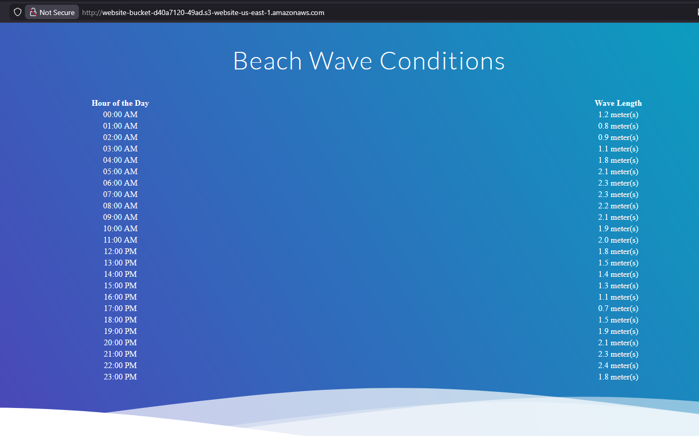

# Lab 01 — Cloud computing essentials

---

## Objective

Migrate a client's static website to Amazon S3 by configuring a bucket for web hosting, setting the correct permissions, and defining index and error documents.

---

## AWS services used

| Service | Purpose in this lab |
|---------|---------------------|
| `Amazon S3` | Hosted a static website and managed object storage |

---

## What I did

1. Launched the AWS lab and navigated to Amazon S3.
2. Accessed the bucket `website-bucket-d40a7120-49ad`.
3. Renamed an HTML file to reflect its purpose as an error page for end users.
4. Navigated to Edit Static Website Hosting settings.
5. Set the Index Document to `index.html` and the Error Document to `error.html`.
6. Configured bucket permissions to allow public access for static hosting.

---

## Key concepts learned

### S3 regions
S3 buckets are stored in a chosen AWS region. Region selection affects latency, cost, and regulatory requirements. Objects remain in their region unless explicitly moved or copied.

### Bucket and user policies
Both bucket policies and user policies are written in JSON format. Bucket policies apply at the resource level; user policies attach to IAM identities.

### Static website hosting requirements
Three things are required to host a static website on S3:
- Configure the bucket for website hosting
- Set the correct permissions
- Add an index document

Optional configurations include redirects, logging, and custom error pages.

### Encryption at rest
Data uploaded to S3 is automatically encrypted before being saved to AWS data centers. It is automatically decrypted when accessed.

---

## Security relevance

> S3 bucket misconfigurations — such as unintended public access — are one of the most
> common causes of cloud data breaches. Understanding how bucket policies and public
> access blocks work is foundational for any SOC analyst monitoring cloud environments.

---

## Screenshots

| Description | Screenshot |
|-------------|------------|
| Static website hosting enabled |  |
| Index and error documents configured |  |
| Confirmed website is back up |  |

---
*Part of my [AWS Cloud Quest Labs](../../README.md) repo.*
